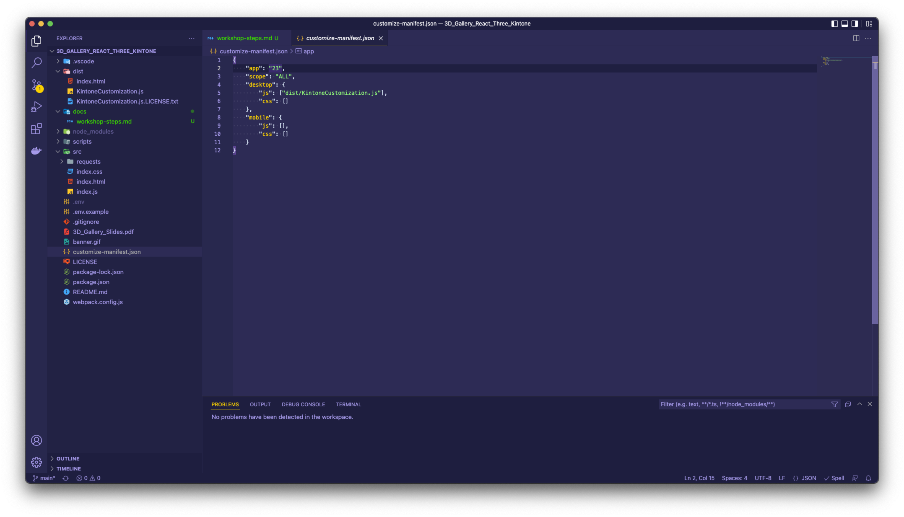
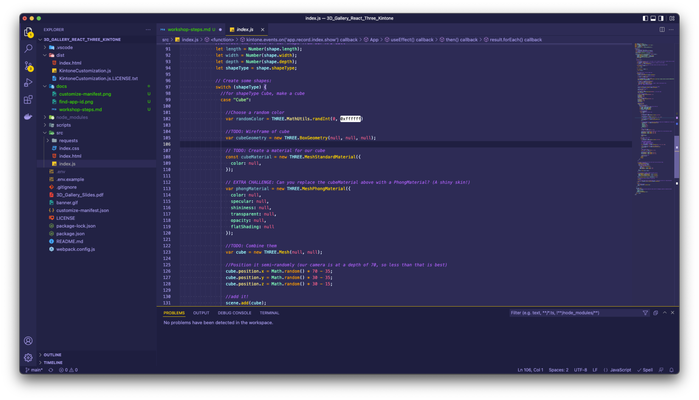
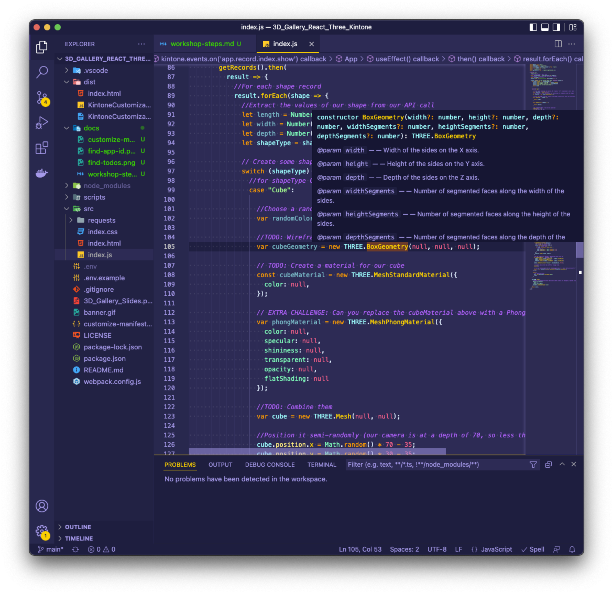
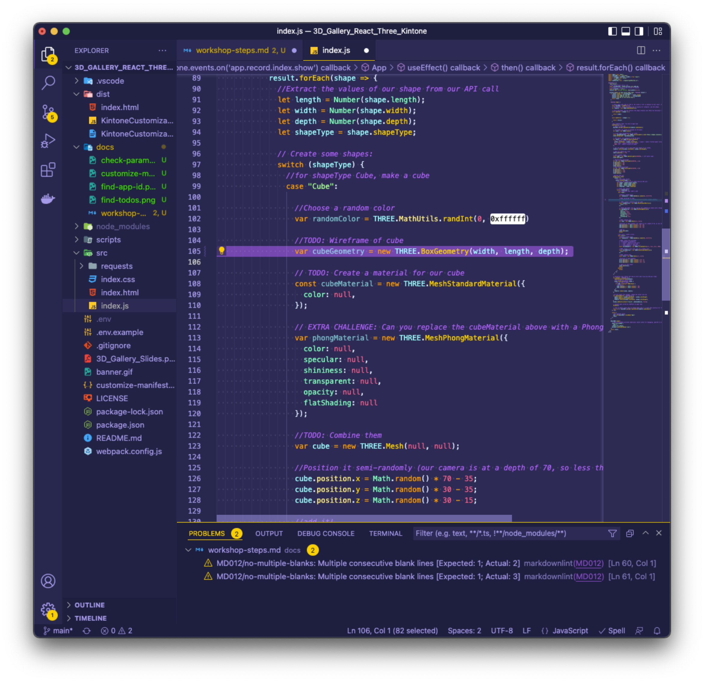
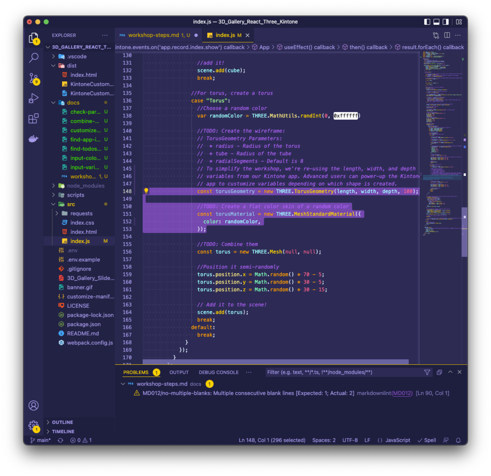

# Create a 3D Gallery with React and Three.js for [Kintone Web Database](https://developer.kintone.io/hc/en-us/)

## Outline

* [Get Started](#get-started)
* [Edit your customize-manifest.json](#edit-your-customize-manifest-json)
* [Edit index.js](#edit-index-js)

## Get Started

First, let's download the [sean-kintone/3D-Kintone-Gallery](https://github.com/sean-kintone/3D-Kintone-Gallery) Repo and go inside the folder.

Once you are inside the folder, let's install the dependencies!

```shell
cd Downloads

git clone https://github.com/sean-kintone/3D-Kintone-Gallery

cd 3D-Kintone-Gallery

npm install

npm install -g @kintone/customize-uploader
```

## Edit Your customize-manifest json



First, we need to tell our uploading scripts which Kintone App we will be working on.
We can find our App ID number easily from the URL of our Kintone App


---

## Edit index js

Our example code is mostly filled in and at first glance looks pretty unfamiliar, but fear not! This was mostly taken directly from the [official documentation](https://threejs.org/docs/index.html#manual/en/introduction/Creating-a-scene). We explain the functions and different parts of our code with comments, so make sure to read (and in the future write) the comments.

The incomplete parts of the code have been marked with TODO comments, as below.



As we already have a working `scene`, `camera`, and `lighting`, all we need are some shapes, specifically cubes and torus.
The code says that we are creating a new `box geometry`, but the values there are null. That seems like a good place to start.

What is a `geometry`? A `geometry` is the mathematical dimensions of the object we want to  display -- how long is it, what is the radius, etc.
The tricky part is what a `geometry` is *not*. The `geometry` is just an invisible wireframe. In order to see our shapes, we'll have to combine them with `material` which is our "skin" around the `geometry`. Our `material` can have color, reflectivity, texture, etc.

For our geometry, how can we know what values to put in? For those of us who are used to thinking in 3D space, it might seem reasonable that a cube should have a width, length, and depth. But let's check to make sure.

First, we hover over the object, to see if our IDE will tell us anything useful:



Here our IDE shows us the "constructor", which shows the parameters that can be used to create an object. It looks like our cube can take width, height, length, widthSegments, heightSegments, and lengthSegments, and they are all optional, which is denoted with a question mark.

Great, let's pass in our dimensions:

`var cubeGeometry = new THREE.BoxGeometry(width, length, depth);`



Our next TODO is to complete the CubeMaterial variable. Hovering with our IDE tells us that it takes a `MeshStandardMaterialParameters`, which isn't *too* helpful. Let's check the [documentation](https://threejs.org/docs/index.html?q=mesh#api/en/materials/MeshStandardMaterial).

> .color : Color -- Color of the material, by default set to white (0xffffff).

It looks like our material can take a color parameter. We've used some THREE.JS tools to randomly pick a color on line 102, but you can manually pick a color using hex format.

`const cubeMaterial = new THREE.MeshStandardMaterial({color: randomColor,});`


Definitely feel free to experiment with adding parameters listed in the documentation. THREE.JS is more of an "art" than coding sometimes, and some very fun and beautiful effects can be created with a little effort.

Next, we need to combine our `geometry` with our `material` to create a `mesh`, which will get added to our `scene`.


Hovering with our IDE tells us the order our variable parameters get passed to our `mesh`: `cubeGeometry`, `cubeMaterial`.

There are some other pre-filled in areas, which position our cube, and later spin it. We recommend checking the documentation and play with the variables after completing this workshop to get more comfortable with THREE.JS.

Now that our cube is completed, we need to repeat the steps with our torus. We'll fill in the missing variables for our `torusGeometry` and `torusMaterial`.

`const torusGeometry = new THREE.TorusGeometry(length, width, depth, 100);`

`const torusMaterial = new THREE.MeshStandardMaterial({color: randomColor});`



Lastly, we combine our `torusGeometry` and `torusMaterial` into a `mesh` and add it to our scene:

`const torus = new THREE.Mesh(torusGeometry, torusMaterial);`


With this, we can save our work, and run kintone-customize-uploader (See the 3D_Gallery_Slides.pdf for more info!) with `npm run start` in your terminal. Navigate to your app, select the gallery view we created, and enjoy your cool 3D space!

---
